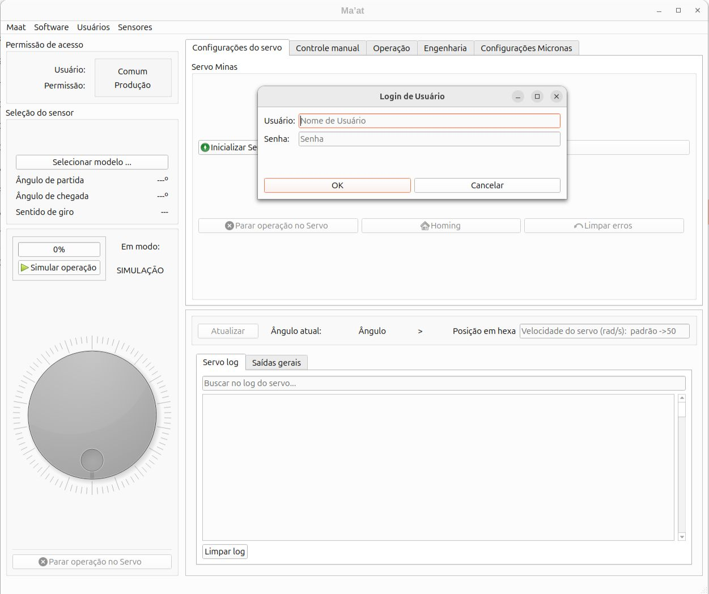

# Ma'at project 
### Industrial Motor Control System via EtherCAT  

This project is a real-time control software system for high-precision industrial servomotors using the EtherCAT protocol. It was developed as part of embedded systems research, focusing on next-generation industrial automation applications.  

**Author**: Lucas Sales Duarte  
**Development Period**: January–February 2025  

## Introduction  

Precise control of industrial motors is critical for applications requiring ultra-high reliability and performance, such as advanced robotics, industrial automation, and medical equipment. The EtherCAT protocol excels in real-time communication with minimal latency, but its software-level implementation presents significant technical challenges.  

### Current Challenges  

Industrial motor control systems often face:  
- **Integration difficulties** between protocols and user interfaces  
- **Lack of flexibility** in control modes  
- **Role-based** to different user's access   
- **Diagnostics** to error logging  

## System Architecture  

### Core Components  
1. **Communication Layer (C)**:  
   - EtherCAT master via SOEM  
   - 4ms cyclic data updates  

2. **Control Layer (C++)**:  
   - Settable Manual Jog 
   - Automated operation of turning the servo
   - 23-bit encoder data processing  

3. **Interface Layer (Qt)**:  
   - Real-time monitoring dashboard  
   - Role-based access control 
   - Intuitive layout

  
*Figure 1: Details of the mainpage*  

## Key Features  

- Real-time motor control  
- Multi-threaded architecture  
- Secure user management  
- Comprehensive logging  

